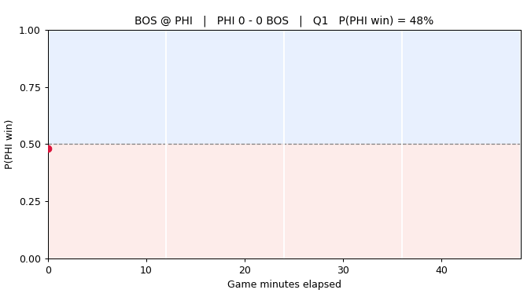
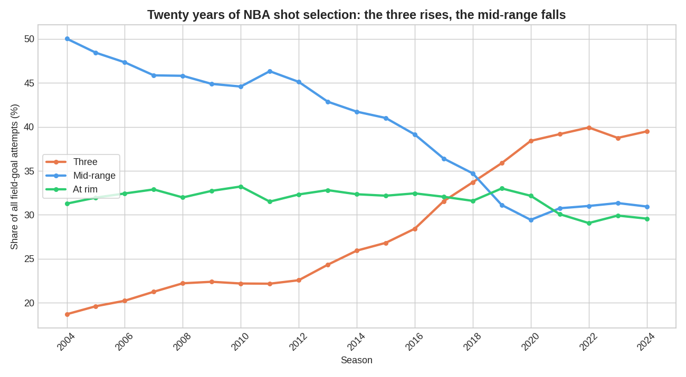

# NBA Analytics Engine

A three-phase NBA analytics portfolio project. One shared data pipeline feeds three
models of escalating difficulty:

| Phase | Model | Status |
|-------|-------|--------|
| 1 | Game outcome predictor (logistic regression) | ✅ Complete |
| 2 | Shot quality model — xFG% (XGBoost) | ✅ Complete |
| 3 | Live win-probability model + Streamlit dashboard | ✅ Complete |

All data is pulled from the public `nba_api`, cached locally under `data/` (never
committed), and every model is evaluated against an honest naive baseline with a
**time-based** train/test split — no random shuffling, no tuning on the test set.

**Highlight — one engine:** Phase 1's game-level model is reused as a *pregame prior*
for Phase 3's live win-probability model, so a game no longer starts at a generic
50/50 but at the strength of the teams playing. See [Phase 3](#phase-3--win-probability-model--dashboard).



## Repo layout

```
src/ingest/     shared nba_api access + caching (used by every phase)
src/phase1/     game predictor (logistic regression)
src/phase2/     shot quality / xFG% (XGBoost)
src/phase3/     win probability (parser, logistic + prior, net, recalibration, dashboard)
notebooks/      one exploration notebook per phase
tests/          regression tests
data/           cached API pulls (gitignored)
```

## Setup

```bash
pip install nba_api pandas scikit-learn xgboost seaborn matplotlib jupyter streamlit plotly torch scipy
```

## Phase 1 — Game predictor

Predicts whether the **home team wins** from each team's recent form and rest,
using 10 seasons of team game logs (2015-16 → 2024-25).

**Run it:**

```bash
python -m src.phase1.game_predictor      # fetches (once) + trains + reports
jupyter notebook notebooks/phase1.ipynb  # plots
```

### Features (all leak-free)

Every rolling feature is computed per (team, season) and **shifted by one game**,
so a game is never part of its own inputs. A runtime leakage guard asserts that the
first games of each team-season have no rolling features. Features are expressed as
home-minus-away differences:

- `d_pts`, `d_pts_allowed` — rolling points scored / allowed (last 10 games)
- `d_rest` — rest-day difference
- *(stretch)* `d_off_rating`, `d_def_rating` — rolling offensive/defensive rating
- *(stretch)* `home_b2b`, `away_b2b` — back-to-back flags

> Rolling win% was tested and dropped: scoring margin (`d_pts`/`d_pts_allowed`)
> subsumes it, and removing it left accuracy unchanged (actually a touch higher).

### Results

Trained on 2015-16 → 2022-23 (8,889 games), tested on the held-out 2023-24 and
2024-25 seasons (2,297 games).

| Model | Accuracy | Log loss |
|-------|----------|----------|
| **Naive baseline** (always pick home) | 0.545 | 0.689 |
| Base (form + rest) | 0.648 | 0.626 |
| Extended (+ ratings + back-to-back) | **0.659** | **0.623** |

The model beats the baseline on both accuracy and log loss. Accuracy sits in the
mid-60s % — in line with what public data supports for NBA game prediction, and
comfortably below the ~70% level that would signal data leakage.

**What matters most** (standardized coefficients): rolling scoring margin
(`d_pts`, `d_pts_allowed`) dominates; rest and back-to-back effects are real but
small. Margin already encodes team strength, which is why rolling win% was
redundant and dropped.

**Rest matters, monotonically.** Home win rate by rest-day advantage:

| Away more rested (≤ -2) | -1 | Even | +1 | Home more rested (≥ +2) |
|:---:|:---:|:---:|:---:|:---:|
| 52.7% | 53.9% | 55.8% | 59.8% | 62.6% |

### A COVID natural experiment (home crowds)

Part of 2019-20 (the Orlando "bubble") and much of 2020-21 were played in empty or
reduced-capacity arenas. If home-court advantage is partly a *crowd* effect, home
win% should dip in exactly those seasons — and it does:

| 2015-16 → 2018-19 | 2019-20 | 2020-21 | 2021-22 | 2022-23 | 2023-24 | 2024-25 |
|:---:|:---:|:---:|:---:|:---:|:---:|:---:|
| **58.6%** (avg) | 55.1% | 54.4% | 54.4% | 58.1% | 54.3% | 54.5% |

Home win% falls ~4.5 points in the empty-arena seasons — direct, if circumstantial,
evidence of the crowd's contribution to home advantage, detected inside our own
pipeline with no extra data. The honest caveat: it never fully rebounds to the
pre-COVID ~59%, so a broader league-wide decline in home-court advantage is also at
work — the crowd effect is real but not the whole story.

### Lessons learned

- A single `LeagueGameLog` call per season is far more polite (and faster) than
  pulling each team separately — 10 API calls for 10 seasons.
- Rolling scoring margin carries most of the signal; adding win% on top is nearly
  redundant. Extra features (ratings, back-to-back) gave a small, honest lift.
- Getting the `shift(1)`-then-`rolling` order right — and guarding it with an
  assertion — is the whole ballgame for avoiding leakage.

## Phase 2 — Shot quality model (xFG%)

Predicts the probability a field-goal attempt goes in, from **512,000 shots**
across 5 seasons (2020-21 → 2024-25) of league-wide `shotchartdetail` data.

> The COVID-affected 2020-21 season is kept deliberately. Empty arenas plausibly
> affect *game outcomes* (see the Phase 1 crowd analysis) but there's little reason
> a *shot's* make probability given its location changes with crowd size, so it's
> fair training data here — and dropping ~100k shots would cost more than it buys.

**Run it:**

```bash
python -m src.phase2.shot_quality       # fetches (once) + trains + reports
jupyter notebook notebooks/phase2.ipynb  # shot chart + calibration
```

### Data limitation (important)

The public `shotchartdetail` endpoint does **not** expose **defender distance,
shot-clock, or score margin** for these seasons — the three signals that would
most improve a shot-difficulty model. Rather than fake them, the model uses only
what the endpoint actually provides:

- `shot_distance`, `loc_x`, `loc_y`, and a derived `shot_angle`
- `is_three`, `period`, `time_remaining_sec` (game clock)
- one-hot `SHOT_ZONE_BASIC` and the 15 most common `ACTION_TYPE`s (layup, jumper,
  dunk, …)

### Results

XGBoost, trained on 2020-21 → 2023-24 (409,600 shots), tested on the held-out
2024-25 season (102,400 shots).

| Model | Log loss | ROC-AUC |
|-------|----------|---------|
| **Naive baseline** (league-average 46.6%) | 0.691 | 0.500 |
| XGBoost xFG% | **0.640** | **0.657** |

A meaningful but modest lift, and well calibrated (predicted probabilities track
observed make rates closely). At-rim shots average a predicted ~0.66 make
probability versus ~0.36 for threes — the model recovers the shape of shot value
from geometry alone. The mid-0.60s AUC is the honest ceiling for a public-data
model without defender or shot-clock context; a much higher number would be a
red flag.

### Lessons learned

- One `ShotChartDetail` call with `team_id=0, player_id=0` pulls an entire
  season league-wide (~100k shots) — 5 calls for 5 seasons.
- Shot-zone (especially the restricted area) and distance dominate importance;
  the missing defender/shot-clock fields are the real accuracy ceiling, and
  naming that limitation honestly matters more than squeezing out AUC.

## Phase 3 — Win probability model + dashboard

Predicts P(home win) at each moment of a game from live game state. Built
incrementally: the play-by-play **parser is validated on a single game first**,
and the train/test split is proven leak-free, before any season-wide pull or
model training.

### Live replay dashboard


A Streamlit app replays a historical game with a live-updating win-probability
curve. The game shown is chosen automatically as the test game with the **biggest
4th-quarter swing** — here BOS erasing a 90%+ PHI win probability to win 118-110.

```bash
python -m streamlit run src/phase3/dashboard.py   # needs cached play-by-play in data/
python -m src.phase3.make_gif                     # regenerate the GIF above
```

The dashboard adds a play-by-play feed (scoring plays highlighted) and running
leading scorers alongside the curve. It needs the cached play-by-play locally, so
the **GIF above** is what renders on GitHub.

- **Data:** `PlayByPlayV3` (the older `playbyplayv2` is deprecated — the NBA API
  now returns empty JSON for it), fetched and cached one game at a time.
- **Core features per event:** `score_margin`, `secs_left_game`, `period`,
  `is_ot`, and `home_event` (a possession-side proxy). A logistic model is the
  baseline before any neural net.
- **Split:** whole games grouped by season (latest season = test). Because a
  whole game is the atomic unit, no game's events are ever split across train and
  test — enforced by an assertion that the train/test `GAME_ID` sets are disjoint.

### Baseline results (logistic regression)

Trained on 300 sampled games from 2022-23 + 2023-24 (143,603 events), tested on
150 sampled 2024-25 games (72,290 events).

| Model | Log loss | ROC-AUC |
|-------|----------|---------|
| **Naive baseline** (constant base rate) | 0.695 | 0.500 |
| Logistic (core features) | **0.454** | **0.860** |

The high AUC is expected, not leakage: late-game events (large margin, seconds
left) are trivially predictable, so a win-prob model pooled over all events scores
high by construction. An urgency-weighted margin (`margin_urgency = margin /
(minutes_left + 1)`) dominates; the `home_event` possession proxy has a coefficient
near zero.

**Error analysis (does more state pay rent?).** Calibration is good in the fourth
quarter but the model *over-predicts* the home team early in games. The cause isn't
missing foul/timeout state — it's that home-court advantage was higher in the
training seasons than in the 2024-25 test season (the same decline documented in the
Phase 1 analysis), so the intercept is too home-friendly early. Conclusion: **bonus
state, timeouts, and true possession are not worth adding** (the possession proxy
already contributes ~nothing). What *would* help is a pregame team-strength prior —
which is exactly the upgrade below.

### One engine: reusing Phase 1 as a pregame prior

A pure in-game model starts *every* game at the same probability, ignoring who is
playing. So we feed **Phase 1's pregame features** (rolling scoring-margin diff, rest
advantage, offensive/defensive-rating diffs) into each event row as prior features —
the game-level model becomes the **prior for the event-level model**, turning three
projects into one engine. The join is leak-free: Phase 1's features use only games
*before* each game (rolling `shift(1)` within a team-season), so a game's prior never
sees itself.

| Model | Log loss | ROC-AUC |
|-------|----------|---------|
| Naive baseline (constant base rate) | 0.695 | 0.500 |
| Core (in-game features only) | 0.454 | 0.860 |
| **Core + Phase 1 prior** | **0.423** | **0.884** |

**The prior pays rent, and the blend works as intended:**
- Opening-tip P(home) spread across games goes from **std 0.000 → 0.111** — every game
  used to start identical; now they open by team strength (opening prediction
  correlates **0.95** with the pregame margin diff). In the demo game the prior opens
  PHI at **48%**, correctly favouring the stronger BOS despite PHI being home.
- The prior is **washed out late**: in last-2-minute blowouts the core and core+prior
  predictions differ by an average of **0.0006** — margin and time take over.

**Nuance:** the prior improves *discrimination* (log loss and AUC) but does **not** by
itself fix the early-game home over-prediction — that's an *intercept* problem from the
home-advantage decline across seasons, addressed by recalibration below.

### Recalibrating the early-game home bias

The model over-predicts the home team early (Q1 predicts 0.61 vs actual 0.55) because
home-court advantage was higher in the training seasons than in 2024-25 — an intercept
issue, not a features issue. Fix: a **single log-odds shift**, fit so the mean prediction
matches the home-win rate of the most recent *training* season (2023-24, whose home
advantage already matches the test era). Leak-free (never uses the test set), one
parameter, and a constant logit shift barely moves the saturated endgame.

| Period | Events | Actual | Predicted (before) | Predicted (after) |
|--------|-------:|-------:|-------------------:|------------------:|
| Q1 | 17,434 | 0.547 | 0.607 | **0.554** |
| Q2 | 18,401 | 0.541 | 0.603 | **0.559** |
| Q3 | 17,799 | 0.550 | 0.586 | **0.552** |
| Q4 | 18,150 | 0.541 | 0.554 | **0.535** |

It works: the early-game bias collapses (Q1 from +6 points to +0.7) and overall log loss
improves 0.4226 → 0.4166, with the endgame untouched.

### Does a neural net beat logistic-plus-prior?

A small PyTorch feed-forward net on the same features and split, early-stopped on a
game-disjoint validation set:

| Model | Log loss | ROC-AUC |
|-------|----------|---------|
| Logistic (core) | 0.454 | 0.860 |
| **Logistic (core + prior)** | **0.423** | **0.884** |
| PyTorch net (core + prior) | 0.468 | 0.861 |

**No — and that's the finding.** Unregularized, the net overfits (test log loss diverges
as it trains); across regularization settings it plateaus near the logistic-*core* level
and never beats logistic-plus-prior. The win-probability relationship is close to linear
in log-odds, so a well-regularized logistic model is the right tool — the net adds
variance without reducing bias. A clean negative result worth more than a forced win.

### Run the rest of Phase 3

```bash
python -m src.phase3.win_prob      # parse one game + prove the leak-free split
python -m src.phase3.baseline      # logistic core vs core+prior (before/after)
python -m src.phase3.recalibrate   # intercept recalibration experiment
python -m src.phase3.net           # PyTorch net comparison
python tests/test_phase3_dashboard.py   # regression tests
```

## What I learned

- **Leakage is a discipline, not a checkbox.** Every phase’s features are strictly
  past-only (`shift(1)` rolling, whole-game splits, priors from earlier games) and
  guarded by runtime assertions — because the fastest way to a great-looking, useless
  model is to let the future leak in.
- **The naive baseline keeps you honest.** Home-team-wins, league-average FG%, and a
  constant base rate are in every results table. A model only earns attention by beating
  them, and a suspiciously large win is a leakage alarm, not a trophy.
- **Say what the data can’t do.** The shot-chart endpoint has no defender distance or
  shot clock; PlayByPlayV2 was deprecated mid-project. I documented the limits and used
  the newer endpoint rather than papering over them.
- **Simpler often wins.** Rolling win% was redundant with scoring margin; a neural net
  couldn’t beat a well-regularized logistic model. Both are reported as findings, not
  buried.
- **The best idea reused work.** Feeding Phase 1’s game model into Phase 3 as a pregame
  prior — “one engine” — was the highest-leverage change, improving log loss and AUC and
  making the win-probability curves start where they should.
- **A real bug taught real caching.** A live `KeyError` traced to a stale Streamlit cache
  after a schema change; the fix was cache versioning plus a fail-fast assertion and a
  regression test — not a defensive patch.

## Tech

Python · pandas · scikit-learn · XGBoost · PyTorch · seaborn/matplotlib · Streamlit ·
`nba_api`. Data cached locally (never committed); all splits are time-based.

## Phase 2 extension: twenty years of shot selection

Basketball's biggest strategic shift this century is visible directly in the shot data. Using a local archive of roughly 4.2 million shots across 21 seasons (2004 through 2024), this analysis charts the share of field goal attempts that were threes, mid range jumpers, and shots at the rim, one season at a time.



The story the data tells:

- **Threes more than doubled**, from 18.7 percent of all attempts in 2004 to 39.5 percent in 2024.
- **The mid range collapsed**, from 50.0 percent to 30.9 percent, as teams learned that a long two is the least efficient shot on the floor.
- **Shots at the rim stayed roughly flat** near 30 percent: the rim was always efficient, so there was nothing to correct.

The crossover, where the three point line overtakes the mid range as the more common shot, lands around 2018, which matches the on court eye test of the modern pace and space era. This is the same efficiency logic that Phase 2's shot quality model recovers from geometry: shots at the rim and behind the arc are worth more per attempt than the long two, and two decades of league wide behavior reflect exactly that.

**Run it:**

```bash
python -m src.phase2.shot_evolution   # reads data/shots_archive/*.csv, writes docs/shot_evolution.png
```

The archive CSVs are large (hundreds of MB) and are never committed; the script reads them locally from `data/shots_archive/` and only the chart above is checked in.
